<h1 align="center">Zurab Gagnidze</h1>

  Full-stack developer · Tbilisi, Georgia 🇬🇪 
  <i> 🐧 </i>

  
  
  

---

I build things end to end — Angular on the front, Node/TypeScript on the back, and my own hardware underneath it. Most of what I ship runs on a Debian box in my apartment rather than someone else's cloud, which has taught me more about TLS, reverse proxies and DNS than any tutorial did.

Currently going deep on backend fundamentals: transactional correctness, queue-backed pipelines, and storage engines.

### 🔨 What I'm building

| Project | What it is | Stack |
| --- | --- | --- |
| **[Chat app][chat]** | Real-time messaging with a full media pipeline: presigned S3 uploads, antivirus scanning off a queue, HLS transcoding, live upload status over WebSocket. | Angular · Express · MongoDB · Redis · BullMQ · MinIO · ClamAV · FFmpeg |
| **[Recipe sharing app][recipes]** | Full-stack CRUD app with auth, image handling and a typed API client. | Angular · TypeScript · Node |
<!-- | **[jarvisd][jarvis]** | Local-first assistant daemon. Three-tier router: regex → on-device LLM → cloud, so the cheap path handles the common case. | TypeScript · llama.cpp · Vulkan |
| **[Portfolio][portfolio]** | Zoneless Angular, signals throughout, Tailwind v4 CSS-first config. | Angular · Tailwind | -->

### 🧰 Stack

- **Frontend** — Angular (zoneless, signals-first, standalone, OnPush), TypeScript, RxJS, Tailwind
- **Backend** — Node.js, Express, REST, WebSockets, BullMQ
- **Data** — MongoDB/Mongoose, Redis, PostgreSQL, Oracle/PL-SQL
- **Infra** — Docker, Coolify, Traefik, Cloudflare Tunnel, MinIO, Debian, Linux

### 🖥️ Homelab

Everything above is self-hosted on a home server: Coolify for deploys, Traefik for routing and certs, Cloudflare Tunnel so nothing is port-forwarded, Tailscale for private access. Daily driver is Arch + Hyprland.

### 📫 Reach me

- **Email** — [zuragagnidze50@gmail.com](mailto:zuragagnidze50@gmail.com)
- **LinkedIn** — [Zurab Gagnidze](https://linkedin.com/in/zurabi-gagnidze)

📊 GitHub stats

 

<!-- Generated nightly by .github/workflows/stats.yml — no external service at render time. -->

[chat]: https://chat-app.zura156.xyz
[recipes]: https://github.com/zura156/recipe-sharing-app
<!-- [jarvis]: https://github.com/zura156/jarvisd
[portfolio]: https://github.com/zura156/portfolio -->
